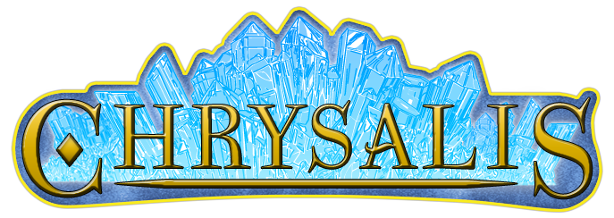

Chrysalis Game Data
####################

This repository contains the scenario and media files for the `Chrysalis Roleplay Games <https://chrysalis-game.com/>`_:

- Descent (one-shot table-top RPG)
- Mindstorm (single-day murder party)
- Auction (alternate reality game, mixing live encounters and web interactions)

You may freely modify, use and share these assets under the `Creative Commons - Non Commercial <https://creativecommons.org/licenses/by-nc/3.0/fr/deed.en>`_ license. Their authors are listed in the `team page <https://chrysalis-game.com/cms/a-propos/equipe/>`_ of the Chrysalis Game website. For commercial use of media or text files, please contact us via this website. Python code files, on the other hand, are released under a permissive `MIT license <https://opensource.org/licenses/MIT>`_.

**For now, Chrysalis texts are in French only, sorry for the inconvenience.**

Use with the Pychronia Portal
========================================

Most of this content can be loaded into a web portal called Pychronia, for use in an online context with per-player user accounts.

See the `repository of the Pychronia portal <https://github.com/ChrysalisTeam/pychronia/>`_, and especially its "GETTING_STARTED.txt" doc, for more information.

A demo of the portal (with chrysalis game data loaded) is available on the Chrysalis Game website.

Generation of PDF scenario files and other documents 
=======================================================

The "docs/" subfolder contains python scripts to automatically generate PDF documents for the games of the Chrysalis universe, while checking scenario consistency along the way.

To know more about these utilities, see the article `Assisted script writing, with Pychronia Tools <https://medium.com/@pakaldebonchamp/assisted-script-writing-with-pychronia-tools-92dc6809e1de>`_.

You can use these utilities, especially the "rpg_sheet_generator.py" mini-lib, to produce your own auto-validated story files from `restructuredtext <http://docutils.sourceforge.net/rst.html>`_ files.

Note that output folders will contain restructuredtext files along their PDF counter-parts, so that you may debug in case of PDF conversion errors, or fallback to manual `rst2pdf <https://github.com/rst2pdf/rst2pdf>`_ invocation if needed.

Common setup
---------------

Due to some remaining incompatibilities in restructuredtext-to-pdf plugins, the toolchain is still under Python2.7, and uses some old versions of its dependencies.
As a result, an error *"[ERROR] createpdf.py:565 Can't find cover template assets/pdf_cover.tpl, using default"* still happens for now, but it doesn't prevent PDF generation.

To use it, create a python2.7 virtual environments (see https://virtualenv.pypa.io/en/latest/) and **activate it**.

Then install common dependencies, from inside the root folder of the repository::

	pip install -r requirements.txt
	
Then go into the tooling folder::

	cd docs/

Chrysalis:Descent
---------------------

Run::

	python build_descent_pdfs.py
	
The "docs/output_descent/" folder should then contain the gamemaster manual, and character sheets, for this tabletop roleplay game.

They are meant to be used along the assets of the "descent_media/" folder.

Chrysalis:Mindstorm
---------------------

Run::
	
	python build_mindstorm_pdfs.py

This script relies on the presence of an "docs/_initial_game_data_dump.yaml" file, a dump of the data stored in the pychronia portal database, which includes some scenario texts as well as the list of players.
If this yaml file present, the script will attempt to generate it using the pychronia code, but the python2/3 incompatibility currently breaks this features. 
In this case, run the pychronia portal normally, and copy/paste the yaml data from the "database content" page of the gamemaster area of your game.

This script is quite long to run, so you might want to disable some steps later in build_mindstorm_pdfs.py (by replacing some "if True:" by "if False:"), to regenerate only what you need.

The "docs/output_mindstorm/" folder should then contain the gamemaster manual, character sheets, summary docs, and in-game documents for this murder party game.

If you have put properly named images in "trombinoscope/" folder, the generated common_guests_gallery.pdf file will gather them.

You'll need to have LibreOffice installed in your system so that separate documents can be extracted from ingame_clues.odt file using "unoconv.py".
This step might fail if the pagination of this ODT file is altered on your system (e.g. fonts missing), in this case edit it by hand to respect the splitting information stored in INGAME_CLUES_PARTS python variable.

Chrysalis:Auction
---------------------

Run::

	python build_auction_pdfs.py

The "docs/output_auction/" folder should then contain the whole gamemaster manual for this alternate reality game, as well as a preview version with only a few pages (and some broken internal links in it).

These documents are meant to be used with the different media of this repository, as well as the Pychronia portal, to master the adventure.

